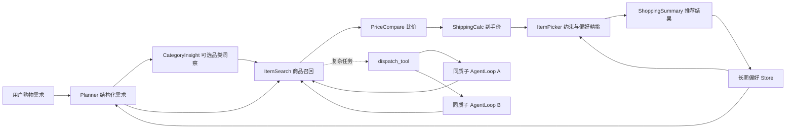
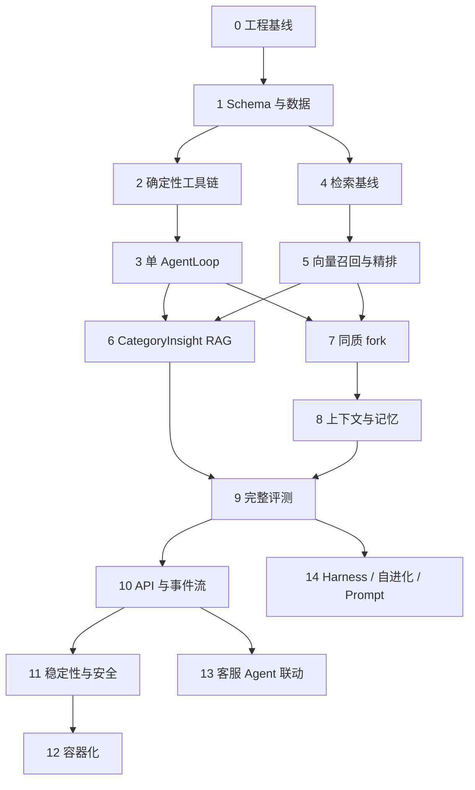

# Globex 电商搜索 Agent 完整工程计划

> 状态：阶段 5 已关闭；阶段 6 中文淘宝版整改完成（v1 基线 + 全量精排对照）；架构迁移 Phase 0-4 完成，Phase 5 评测/部署/文档已落地
> 当前阅读进度：已读完第 15 章
> 当前代码状态：淘宝 shopsimulator_retrieval_v1 已冻结 115 query 并出 FTS/BGE-M3/Hybrid/Reranker 指标；商品 runtime 接 canonical ANN fallback，知识卡 runtime 默认动态 Hybrid 且 Reranker 显式 opt-in
> 实施原则：离线优先、纵向切片、接口与实现解耦、每阶段必须实际运行并验收

## 1. 项目目标

实现一个可独立演示、可评测、可继续演进的电商搜索 Agent。用户用自然语言描述预算、用途和偏好后，系统能够：

架构迁移以 `docs/architecture_migration_handoff.md` 为唯一执行依据：主 Agent 默认单干，
批量 `task_dispatch` 并行调度 `search_agent` / `trade_agent`；商品继续用 `StandardItem`，
知识卡继续用 `CategoryCard`；不引入 AgentScope / Qdrant / Product-Sku 领域模型。

1. 理解并结构化购物需求。
2. 从本地商品数据中召回候选商品。
3. 结合语义相关性、用户偏好、价格、运费和约束进行筛选。
4. 在任务复杂时按需 fork 同质子 AgentLoop 并行处理。
5. 输出结构化推荐清单、选择理由、风险与数据来源。
6. 保存可控的长期偏好，并在后续会话中使用。
7. 通过评测脚本展示真实、可复现的效果指标。
8. 通过 FastAPI 和 WebSocket 暴露服务，并能被后续客服 Agent 调用。

第一版不是复刻大型电商平台，也不追求生产规模。第一版的目标是证明完整工程链路，并让每一项简历描述都有代码、测试和运行证据。

## 2. 项目范围

### 2.1 核心交付范围

- 小规模、可检查的本地商品目录。
- 统一商品 Schema 和数据校验。
- 9 个业务工具中的核心离线实现。
- 单 AgentLoop 的 Think → Act → Observe → Reflect 闭环。
- Query / Item 双塔向量召回与 Reranker；BM25 和 Hybrid 分别作为基线与扩展消融。
- CategoryInsight 商品知识 RAG。
- 主 AgentLoop + 按需 fork 的同质子 AgentLoop。
- Cache Breakpoint、工具结果压缩和长期偏好 Store。
- 检索评测、工具评测、Agent 轨迹评测与回归测试。
- FastAPI、任务取消、WebSocket/AGUI 事件流。
- 面向客服 Agent 的稳定推荐能力接口。

### 2.2 暂不进入第一版

- 京东、淘宝等真实线上平台 API。
- 对平台页面进行爬取。
- 生产级 OpenSearch、Milvus、Redis 集群；阶段 6 仅按课程在本机 Docker 中运行单节点 OpenSearch。
- vLLM、GPU 服务和 K8s。
- 从零训练双塔 Embedding、SFT 或 Agentic RL。
- 完整 React 商业前端。
- 自动修改 Prompt 或自动训练的全自动飞轮。

这些能力只在本地闭环稳定且有评测基线后再决定是否引入。

## 3. 最终主链路



完整工具集包括：

| 工具 | 第一版定位 |
| --- | --- |
| `Planner` | 把自然语言需求转换成预算、品类、偏好、硬约束 |
| `ChatFallback` | 非购物问题、信息不足和需要澄清时的终结性兜底 |
| `WebSearch` | 第一版默认关闭；后续作为外部信息兜底 |
| `CategoryInsight` | 从本地品类知识卡中召回选购知识 |
| `ItemSearch` | 对统一商品目录执行关键词与 Query/Item 双塔语义召回 |
| `ItemPicker` | 在候选集中执行硬约束过滤和综合排序 |
| `PriceCompare` | 对同一标准商品的多平台报价进行比较 |
| `ShippingCalc` | 计算运费、税费和到手价估算 |
| `ShoppingSummary` | 输出最终推荐清单，是终结性工具 |
| `dispatch_tool` | 元工具；按需 fork 同质子 AgentLoop，不属于业务工具 |

## 4. 工程原则与关键取舍

1. **先确定性后智能化**：先用普通 Python 串通工具，再让 LLM 决定调用顺序。
2. **先纵向闭环后横向扩展**：先让一条查询从输入走到推荐结果，再丰富所有工具。
3. **接口不绑定后端**：`ItemSearch` 依赖 `SearchBackend` 抽象；本地关键词、向量索引和未来平台 API 都是可替换实现。
4. **本地优先**：先用 JSONL、小型内存索引和本地文件 Store，不提前引入分布式组件。
5. **数据来源透明**：真实字段、派生字段和模拟字段必须可区分。
6. **硬规则交给代码**：预算、币种、黑名单、到手价等约束不能只依赖模型判断。
7. **LLM 输出必须校验**：所有工具入参和关键输出使用 Schema 校验。
8. **失败可以降级**：工具超时、空召回和子 Agent 失败要成为可处理结果，不能拖垮整条任务。
9. **指标不得虚构**：文档中只记录实际跑出的数据集规模、准确率、延迟和成功率。
10. **每阶段可回滚**：每个阶段独立测试、独立示例、独立 Git 提交。

## 5. 目标目录

课程中的 `app/` 目录在本仓库映射为 `src/globex_agent/`，不复制课程文档。

```text
GlobexAgentLearning/
├── src/globex_agent/
│   ├── domain/                 # 核心 Schema、枚举和接口
│   ├── config/                 # 环境和运行配置
│   ├── catalog/                # 商品加载、清洗和标准化
│   ├── tools/                  # 9 个业务工具
│   ├── recall/                 # 关键词、Query/Item 双塔、融合、精排
│   ├── rag/                    # 品类知识卡、索引和检索
│   ├── agent/                  # AgentLoop、工具注册、fork 和中间件
│   ├── memory/                 # 长期偏好 Store
│   ├── context/                # Cache Breakpoint 与上下文压缩
│   ├── api/                    # FastAPI、WebSocket、AGUI 事件
│   ├── eval/                   # 数据集、指标、Rubric 和报告
│   ├── observability/          # 结构化日志、Trace 和运行统计
│   ├── resilience/             # 超时、重试、熔断和幂等
│   └── security/               # 工具白名单、内容过滤和脱敏
├── examples/                   # 各阶段独立可运行示例
├── tests/
│   ├── unit/
│   ├── integration/
│   └── e2e/
├── data/
│   ├── demo/                   # 可提交的小型演示数据
│   ├── processed/              # 可复现生成的小型处理结果
│   └── eval/                   # 固定评测集
├── scripts/
│   ├── data/
│   ├── index/
│   └── eval/
├── output/                     # 本地运行产物，不提交
├── .env.example
├── pyproject.toml
└── ENGINEERING_PLAN.md
```

目录只随阶段逐步创建，不一次性生成空模块。

## 6. 分阶段实施计划

### 阶段 0：工程基线

**目标**

建立最小、可重复的 Python 开发与测试环境。

**任务**

- [x] 确认 Python 版本和虚拟环境。
- [x] 选择依赖管理方式并生成锁文件。
- [x] 只加入当前需要的轻量依赖，并说明每个依赖的用途和替代方案。
- [x] 配置 `pytest`、格式检查和最小导入测试。
- [x] 补全 `.gitignore`，排除 `.env`、原始数据、模型、索引和运行产物。
- [x] 建立首个可运行示例和测试。
- [x] 创建工程基线 Git 提交。

**验收**

- 新环境可以按 README 中的一组命令完成安装。
- `globex_agent` 可以导入。
- 测试命令执行成功，至少包含一个 smoke test。
- 仓库中不存在真实密钥和大型文件。

**阶段产物**

- `pyproject.toml`
- 锁文件
- `tests/test_smoke.py`
- 更新后的 `README.md` 和 `.env.example`

---

### 阶段 1：领域模型与小型商品数据

**目标**

让后续所有工具共享一套稳定的数据契约。

**数据路线**

1. 先制作 30～50 条受控演示商品，覆盖 2～3 个品类和 2～3 个模拟平台。
2. 每个平台商品保留独立的全局 `item_id={platform}:{原平台ID}`；跨平台同款不合并，只通过 `same_group_id` 关联。
3. 再从真实公开数据集中按 `query_id` 抽取子集，避免只抽商品造成查询与标注失联。
4. 价格、平台、运费等公开数据中不存在的字段可以补充，但必须标记为 `synthetic` 或 `derived`。

**核心 Schema**

- `StandardItem`：第 09-1 章的平台级扁平统一商品模型。
- `UserProfile`：偏好、黑名单和历史反馈。
- `Candidate` / `ItemSearchOutput`：第 11 章检索契约。
- `PricePoint` / `PriceCompareOutput` / `LandedCost` / `ShippingCalcOutput`：第 12 章比价与到手价契约。
- `PickedItem` / `ItemPickerOutput` / `ShoppingSummaryOutput`：第 14 章收敛契约。
- `DataProvenance`：字段来源与生成方式。

**任务**

- [x] 定义字段、枚举、必填项和校验规则。
- [x] 编写 JSONL 加载器与错误行报告。
- [x] 建立去重、缺失值和异常价格处理。
- [x] 建立演示商品、用户和查询数据。
- [x] 记录数据来源、许可、抽样规则和模拟字段。

**验收**

- 合法数据全部加载成功。
- 非法币种、负价格、空商品 ID 等错误会被拒绝。
- 同平台同款多链接只保留评分更高/更新时间更新的一条。
- 跨平台同款以独立 `StandardItem` 保留，并能通过 `same_group_id` 找到关联项。
- 测试覆盖成功加载和主要失败分支。

**阶段产物**

- `src/globex_agent/domain/models.py`
- `src/globex_agent/catalog/local_catalog.py`
- `data/demo/products.jsonl`
- `data/demo/users.jsonl`
- `data/README.md`
- `tests/unit/test_models.py`
- `tests/unit/test_local_catalog.py`
- `examples/01_load_catalog.py`

---

### 阶段 2：确定性工具链 MVP

**目标**

不接 LLM，先证明业务工具本身能够从查询走到推荐结果。

**首批工具**

1. `ItemSearch`：按平台分别完成关键词召回和 Top-K，每个平台返回一个 `ItemSearchOutput`。
2. `PriceCompare`：接收合流的 `list[Candidate]`，币种归一并按标价截断 Top-N。
3. `ShippingCalc`：只接收 `PriceCompare.ranked`，估算运费、税费和到手价。
4. `ItemPicker`：执行预算、黑名单等硬约束，再综合排序。
5. `ShoppingSummary`：生成稳定的结构化结果和可读文本。

**任务**

- [x] 为每个工具定义清晰的输入输出 Schema。
- [x] 将纯业务逻辑和未来 Agent Tool 包装分开。
- [x] 固定工具顺序写一个离线 pipeline 示例。
- [x] 按第 12 章的静态汇率、0.5 kg 占位重量、运费表和税率表固定计算假设，并用 `Decimal` 保证精度。
- [x] 对无结果、缺字段、未知平台和超预算实现明确返回。

**验收**

- 固定输入能够稳定得到相同输出。
- 最终推荐不得包含违反硬约束的商品。
- 比价和到手价可以用手算样例核对。
- 任一工具失败不会返回含糊的自由文本异常。

**阶段产物**

- `src/globex_agent/tools/item_search.py`
- `src/globex_agent/tools/price_compare.py`
- `src/globex_agent/tools/shipping_calc.py`
- `src/globex_agent/tools/item_picker.py`
- `src/globex_agent/tools/shopping_summary.py`
- `examples/02_deterministic_pipeline.py`
- 对应单元测试和一条集成测试

**第一个可演示里程碑**

运行一个命令，输入“预算 1500 元、通勤降噪耳机、不要入耳式”，输出 3 个以内的合规推荐、到手价和选择理由。

---

### 阶段 3：单 AgentLoop 最小闭环

**目标**

让 LLM 负责意图理解和工具编排，但仍只运行一个 AgentLoop。

**任务**

- [x] 定义 `Planner` 和 `ChatFallback`。
- [x] 建立统一模型客户端和配置入口。
- [x] 建立 Prompt 文件与加载器。
- [x] 注册当前已实现工具。
- [x] 实现工具调用循环、最大轮数、总超时和终结性工具。
- [x] 使用假的/脚本化模型测试路由。
- [x] 使用本地 `.env` 中的真实模型完成固定 case 和自由文本 smoke test。
- [x] 记录每一轮模型消息、工具名、结果摘要和结束原因。

**验收**

- 购物请求最终进入 `ShoppingSummary`。
- 非购物请求进入 `ChatFallback`。
- 参数不合法时能修正、澄清或安全结束。
- 达到最大轮数和超时时能降级结束。
- 自动化测试不依赖真实模型 API。

**阶段产物**

- `src/globex_agent/agent/llm.py`
- `src/globex_agent/agent/prompts.py`
- `src/globex_agent/agent/tool_registry.py`
- `src/globex_agent/agent/main_agent.py`
- `src/globex_agent/tools/planner.py`
- `src/globex_agent/tools/chat_fallback.py`
- `examples/03_single_agent.py`

---

### 阶段 4：离线检索基线与评测集

**目标**

在引入向量模型前建立可比较的检索基线，防止后续“感觉变好”。

**任务**

- [x] 定义 `SearchBackend` 接口。
- [x] 实现关键词/BM25 风格的本地基线。
- [x] 从公开电商搜索数据抽取小规模查询—商品相关性集合。
- [x] 按查询组划分 train/dev/test，防止相同查询泄漏。
- [x] 实现 Recall@K、MRR@K、NDCG@K 和空召回率。
- [x] 固定评测配置、无随机抽样策略和数据版本。

**验收**

- 一条命令可以从数据准备跑到评测报告。
- 重复运行得到一致结果。
- 报告中记录数据规模、切分方式、配置和真实指标。
- 后续召回实现可以在不改 `ItemSearch` 工具签名的情况下替换。

**阶段产物**

- `src/globex_agent/recall/base.py`
- `src/globex_agent/recall/keyword.py`
- `src/globex_agent/eval/recall_metrics.py`
- `scripts/data/prepare_esci_subset.py`
- `scripts/eval/run_recall_eval.py`
- `data/eval/recall_cases.jsonl`
- `data/eval/recall_items.jsonl`
- `data/eval/recall_manifest.json`

**实际基线（2026-08-15，修正评测口径后）**

- 数据：35 个英文查询组、720 个去重商品；train/dev/test 为 21/6/8。
- 每个 query 只搜索自己的封闭 ESCI 候选池，所有候选都有标注；Recall/MRR 只以 2～5 个 Exact 为正例，Complement/Substitute 只进入分级 NDCG。
- BM25 Top-10：Recall 0.531429、MRR 0.650079、NDCG 0.484503；空召回率 0.028571。
- BM25 Recall@100 为 0.813810；候选池最多 51 条，所以该指标只表示封闭池内检索深度。

---

### 阶段 5：Query/Item 向量召回与 Reranker

**目标**

实现 Query / Item 双塔的可运行离线版本，不构建 User 塔，也不从零训练大模型。

**课程主口径**

- Item 塔：离线编码商品标题、属性和类目。
- Query 塔：在线编码用户当前查询。
- 粗排：Query 向量检索 Item 向量并取 Top-100。
- 精排：CrossEncoder 只对向量 Top-100 打分，再取 Top-10。
- BM25 是词法基线；Hybrid 是可选扩展消融，两者都不进入商品召回主链。
- 知识卡 RAG 的动态 Hybrid 权重和 Top-30 → Top-8 配置不复用于商品召回。
- 用户画像不进入召回向量；它只作为 Planner 上下文和 ItemPicker 的约束/偏好输入。

**任务**

- [x] 选择轻量预训练 Embedding，并记录选择理由。
- [x] 构建和持久化小型本地向量索引。
- [x] 实现 Query 和 Item 编码。
- [x] 保留 BM25 基线，并把 Hybrid 融合隔离为显式扩展消融。
- [x] 实现一个可替换的 Reranker 接口和轻量基线。
- [x] 默认对比 BM25 基线、向量召回、向量召回+精排三组结果。
- [x] 记录准确率与延迟，不只记录最终一组。

**验收**

- 在规范化 query 相同的前提下，用户画像变化不会改变双塔召回结果；画像只影响 Planner 上下文或后置 ItemPicker。
- 用户偏好不能覆盖预算和黑名单等硬约束。
- 向量模型或索引故障必须显式暴露；BM25 可作为业务降级基线，但不改变离线课程主结果的候选来源。
- 评测报告包含消融对比和至少一个 bad case。

**阶段产物**

- `src/globex_agent/recall/embedding.py`
- `src/globex_agent/recall/index.py`
- `src/globex_agent/recall/fusion.py`
- `src/globex_agent/recall/reranker.py`
- `scripts/index/build_item_index.py`
- `scripts/eval/run_retrieval_comparison.py`
- `examples/04_semantic_retrieval.py`
- `output/eval/retrieval_comparison.json`（本地生成）

**实际实现与评测（2026-08-15，修正评测口径后）**

- 双塔模型：官方 `BAAI/bge-m3`，1024 维；BGE-M3 直接编码原始 Query/Item 文本，不沿用 mE5 的 `query:`/`passage:` 前缀。
- Item 输入删除重复 title 和字面量 `None`，Embedding 推理窗口为512；720个清洗后 Item 已在CPU离线编码。
- 内部向量检索不再限制 Top-50，商品主链固定请求 Top-100；ItemSearch 对外契约仍限制最终返回最大 50。
- Faiss 主索引：`IndexHNSWFlat + METRIC_INNER_PRODUCT`，向量先L2归一化；`M=32、efConstruction=200、efSearch=128`，索引清单记录模型、文本版本和全部ANN参数。NumPy精确余弦实现保留为正确性基线。
- 精排：官方原始 `BAAI/bge-reranker-v2-m3`，由项目主环境启动 `blog_04` CUDA 11.8 常驻子进程，运行时转换FP16、batch=1、max_length=256；不是第三方FP16权重。
- 独立 test 主结果：BGE-M3 + Faiss Recall@10 0.758333、NDCG@10 0.644830；BGE精排后 Recall@10 0.875000、MRR@10 0.875000、NDCG@10 0.788628。
- 35-query overall 只作诊断：BGE主链 Recall@10 0.633810、NDCG@10 0.592388，不能与 test 主结果混报。
- 候选 Recall@100：BM25 0.813810、向量/向量+精排 1.000000；逐 query 候选池只有 8～51 条，不能解释为全库 Recall@100。
- P50 延迟：BM25 0.10 ms、BGE-M3 + Faiss 86.68 ms、BGE GPU精排主链 528.32 ms；为本机35-query整体实测，模型下载/加载预热不计入，当前阶段不以商业延迟为目标。
- 三路输出的 ESCI judged coverage 均为 1.0；报告记录 P50/P99、回退次数和相对 BM25 的 bad case。
- Hybrid 代码仍用于扩展研究，但评测只有在 `--include-hybrid-extension` 且显式提供两路权重时才运行；不自动采用知识卡 RAG 的动态权重。

**暂缓项**

本阶段只做召回和推理评测。双塔监督训练、训练数据比例、Hard Negative Mining、InfoNCE 改造和 Reranker 微调不进入当前实现，只保留为后续实验。

---

### 阶段 6：CategoryInsight 与知识卡 RAG

> **状态**：中文淘宝版整改完成。英文 ESCI 演示版保留为历史实验，不再作为当前知识卡底座。

**目标**

让 Agent 在模糊品类需求下先获得可靠的选购知识，而不是直接盲搜商品。

**知识卡**

- `bestseller`：品类代表性商品形态及商品证据。
- `attribute`：关键属性及其在有效样本中的分布。
- `price_range`：便宜款、中档、高端三个有限价格区间。
- 数据来源、生成字段和可信度放在事实表与 provenance sidecar，不扩展课程卡片 Schema。

**任务**

- [x] 定义课程七字段知识卡 Schema。
- [x] 基于淘宝中文目录制作 8 品类、48 张可追溯知识卡；旧 ESCI 12 品类、72 卡保留为历史实验。
- [x] 建立品类归一、商品文本门禁、卡片入库门禁和 10% 抽审队列。
- [x] 按课程用 OpenSearch 实现 BM25 + KNN Hybrid 召回。
- [x] 对 Top-30 召回结果用 BGE 精排，并压缩为 quick Top-8 / deep Top-15。
- [x] 建立 50 条中文 Query、每条 48 卡全判断的 RAG 标注集，并冻结 30/10/10 split 与哈希。
- [x] 实现 Recall@K、MRR、NDCG 评测脚本并运行独立 test 基线。
- [x] 实现向量失败→BM25、知识库失败→空结构 confidence=0、精排失败→粗排的降级；WebSearch 补充因当前无该工具而明确暂缓。

**验收**

- 回答中的关键结论能追溯到知识卡。
- RAG 只提供选购知识，不伪造实时价格与库存。
- 加入 RAG 前后的检索或任务结果可对比。
- 知识卡更新不需要修改 AgentLoop。

**阶段产物**

- `src/globex_agent/category_insight/models.py`
- `src/globex_agent/recall/category_kb.py`
- `src/globex_agent/tools/category_insight.py`
- `data/category_insight/category_cards.jsonl`
- `data/category_insight/category_card_manifest.json`
- `scripts/eval/run_category_recall.py`
- `examples/05_category_insight.py`
- `scripts/data/build_category_cards_taobao_zh.py`
- `scripts/data/build_category_eval_taobao_zh.py`
- `scripts/index/build_category_kb_taobao_zh.py`
- `data/category_insight/taobao_zh/`

**课程合规返工（中文化，已完成）**

课程第 13/13-1 章要求知识卡为中文内容 + 中文 query + ik 分词 + 真实价格/销量口径。
淘宝目录没有真实销量，因此 bestseller 采用同质商品数与属性覆盖度作为离线代理，
并显式标记 `generated_offline_proxy`，不伪造销量。整改清单：

- [x] 决策：首期 8 个普通中文品类（乳胶枕、儿童学习椅、手机直播补光灯、汽车氛围灯、平板电脑支架、颈椎按摩器、羽毛球包、户外电源）。
- [x] 中文 taxonomy：用淘宝 `category_path` 建标准品类表 + 中文标题门禁。
- [x] 数据生产淘宝化：新增 `build_category_cards_taobao_zh.py`；价格用真实 `price_cny`/规格价切三分位，属性用真实 `source_attributes` 聚合，删除固定种子合成。
- [x] 生成中文七字段 `CategoryCard` + 入库门禁 + 10% 抽审。
- [x] 中文评测集：50 条中文 query（名词/属性/气质/口语四类），每条 5 张相关卡，冻结 30/10/10。
- [x] ik 分词 + OpenSearch 重建：`ik_max_word`/`ik_smart` 替换 standard，重建 `globex_category_kb_taobao_zh_v1`。
- [x] 重跑 `run_category_recall`（BM25/KNN/Hybrid/Reranker 四路）+ 更新 5 个 category 单测中文 fixture + pytest/ruff 回归。
- [x] 文档回滚：`category_card_data_contract.md` 改淘宝中文版、旧英文版标历史；README/ENGINEERING_PLAN 阶段 6 状态改为「中文整改完成」。
- [x] Rerank 全量精排对照：v1 基线上不升反降，生产默认保留 0.92 首分跳过。

> 数据来源对照课程：bestseller=内部销售榜+平台榜单（本地无→代理指标）、attribute=商品库属性聚合（淘宝真实属性）、price_range=历史成交价分位数（淘宝真实价格）。

---

### 阶段 7：同质子 AgentLoop 与 fork 协同

**目标**

在单 AgentLoop 已稳定的前提下，加入课程中的按需 fork。

**fork 判断**

只在满足以下至少一项时 fork：

1. 子任务彼此独立且并行能缩短延迟。
2. 子任务会产生大量中间上下文，需要隔离。
3. 子任务内部预计需要至少三步工具调用。

单平台、单关键词、一步工具可完成的任务不 fork。

**任务**

- [ ] 实现 `dispatch_tool(demands)` 元工具。
- [ ] 主/子 Agent 共享同一模型、Prompt 和完整工具集。
- [ ] 子任务拥有独立 `thread_id` 和 checkpoint。
- [ ] 使用 `ContextVar` 传递父任务会话目录等必要上下文。
- [ ] 并行执行独立子任务并结构化合流。
- [ ] 加入 fork 深度、并发数、超时、最大轮数和取消传播。
- [ ] 加入工具结果截断和重复调用检测。
- [ ] 比较不开 fork、顺序 fork、并行 fork 的结果和延迟。

**验收**

- 跨平台或多子需求场景可以并发。
- 子 Agent 的消息历史不污染主 Agent。
- 子 Agent 超时或拒绝 fork 时主 Agent 能继续并降级。
- 禁止无限递归和无边界并发。
- 有自动化测试验证上下文隔离和异常合流。

**阶段产物**

- `src/globex_agent/agent/dispatch_tool.py`
- `src/globex_agent/agent/fork_guard.py`
- `src/globex_agent/agent/middleware.py`
- `tests/integration/test_fork_isolation.py`
- `examples/06_multi_agent_fork.py`

---

### 阶段 8：上下文治理与长期记忆

**目标**

让多轮会话不无限增长，并让稳定偏好可以跨会话复用。

**上下文策略**

- 稳定前缀保持不变以利用 Prompt Cache。
- Cache Breakpoint 之前是稳定历史，之后是当前动态后缀。
- 优先缩短冗长工具结果，再压缩更老的历史。
- 最近若干轮原文保留，摘要不能覆盖关键硬约束。

**记忆策略**

- 只保存稳定、可复用的用户偏好。
- 临时需求不写入长期 Store。
- 记忆包含来源、置信度、创建时间和更新时间。
- 用户可以查看、修改和删除记忆。
- 长期记忆负责偏好表达，并在 Planner / ItemPicker 使用；不再构造 User 塔召回信号。

**任务**

- [ ] 实现文件或 SQLite 版偏好 Store。
- [ ] 实现相关记忆检索和 Prompt 注入。
- [ ] 实现候选新偏好提取、确认和写回。
- [ ] 实现 Cache Breakpoint 和分层压缩。
- [ ] 对摘要遗漏、记忆冲突和错误偏好建立测试。
- [ ] 对长对话记录 token/字符规模变化。

**验收**

- 新会话能够读取已确认偏好。
- 临时预算不会被错误固化为长期偏好。
- 用户新声明与旧记忆冲突时，以当前显式输入优先。
- 长对话压缩后仍保留预算、禁忌和已选候选。
- Store 或压缩模型失败时能够继续完成当前任务。

**阶段产物**

- `src/globex_agent/memory/models.py`
- `src/globex_agent/memory/store.py`
- `src/globex_agent/memory/injector.py`
- `src/globex_agent/context/breakpoint.py`
- `src/globex_agent/context/compressor.py`
- `examples/07_memory_and_context.py`

---

### 阶段 9：完整评测与质量门禁

**目标**

把“项目可以运行”升级为“项目效果可解释、改动可回归”。

**四层评测**

| 层 | 关注点 | 主要指标 |
| --- | --- | --- |
| 数据 | 完整性、合法性、来源 | 错误率、缺失率、重复率 |
| 检索 | 相关商品能否进入候选 | Recall@K、MRR@K、NDCG@K、空召回率 |
| 工具 | 业务计算和约束是否正确 | 单元通过率、约束违例率、工具错误率 |
| Agent | 工具选择、顺序和最终答案 | 任务成功率、终结率、无效调用数、fork 合理性、Rubric 分数 |

**任务**

- [ ] 建立固定离线案例集，覆盖正常、边界和失败场景。
- [ ] 实现确定性规则评分。
- [ ] 实现工具轨迹校验。
- [ ] 在规则评分后增加可选 LLM Judge，并保留输入输出。
- [ ] 记录延迟、工具调用次数、token 和成本。
- [ ] 建立 baseline 与候选版本对比。
- [ ] 失败案例落到 bad-case 文件，不自动进入训练集。
- [ ] 设定回归门禁；阈值来自基线和实际目标，不照抄课程示例数字。

**最少场景**

- 单品类明确需求。
- 多平台比价。
- 模糊需求先做品类洞察。
- 有稳定偏好的个性化搜索。
- 预算冲突和黑名单。
- 空召回和低置信度。
- 子 Agent 超时。
- 非购物请求。
- Prompt Injection/恶意工具指令。

**验收**

- 一条命令生成机器可读 JSON 和可读 Markdown 报告。
- 报告包含数据版本、代码版本、配置和失败案例。
- 修改召回或 Prompt 后可以与基线自动对比。
- 简历中的所有数字都能从报告重现。

**阶段产物**

- `src/globex_agent/eval/cases.py`
- `src/globex_agent/eval/agent_metrics.py`
- `src/globex_agent/eval/rubric.py`
- `src/globex_agent/eval/report.py`
- `data/eval/agent_cases.jsonl`
- `scripts/eval/run_agent_eval.py`

---

### 阶段 10：FastAPI、WebSocket 与 AGUI

**目标**

把本地 Python 能力变成可调用服务，并让长任务过程可见、可取消。

**接口**

- `POST /api/tasks`：提交任务，立即返回 `thread_id`。
- `GET /api/tasks/{thread_id}`：查询状态与最终结果。
- `DELETE /api/tasks/{thread_id}`：取消任务。
- `WS /ws/{thread_id}`：推送标准事件。
- `GET /health`：健康检查。
- `POST /api/recommendations`：面向其他 Agent 的结构化推荐接口。

**事件**

- `task_started`
- `thinking`
- `tool_started` / `tool_finished`
- `fork_started` / `fork_finished`
- `warning` / `error`
- `task_finished` / `task_cancelled`

**任务**

- [ ] 实现请求/响应 Schema。
- [ ] 实现 `thread_id`、会话目录和 `active_tasks`。
- [ ] 实现 WebSocket 连接管理和断线重连。
- [ ] 实现后台任务、取消传播和清理。
- [ ] 将 Agent 事件映射为稳定协议。
- [ ] 编写一个最小命令行或静态页面客户端。
- [ ] 编写 API 与 WebSocket 集成测试。

**验收**

- HTTP 请求不会阻塞等待整个 Agent 完成。
- 两个并发用户的事件、记忆和输出不串台。
- 取消主任务会传播到子任务。
- WebSocket 断线不会导致 Agent 崩溃。
- API 文档可以直接调用完整推荐链路。

**阶段产物**

- `src/globex_agent/api/schemas.py`
- `src/globex_agent/api/context.py`
- `src/globex_agent/api/connection.py`
- `src/globex_agent/api/events.py`
- `src/globex_agent/api/server.py`
- `tests/integration/test_api.py`
- `tests/integration/test_websocket.py`

**第二个可演示里程碑**

客户端提交任务后实时看到“需求拆解 → 检索 → fork → 比价 → 运费 → 精挑 → 总结”，最后收到结构化商品推荐。

---

### 阶段 11：稳定性、可观测性与安全

**目标**

选择第 16～17 章中对作品集最有价值、且本地可验证的生产化能力。

**优先实现**

- [ ] 结构化日志和每次任务的 Trace ID。
- [ ] LLM、工具、fork 的耗时和错误统计。
- [ ] 请求级 token 预算、最大工具次数和模型降级。
- [ ] 工具超时、有限重试和熔断器。
- [ ] 请求幂等和重复提交保护。
- [ ] 工具白名单、角色边界和工具结果内容过滤。
- [ ] 日志中的密钥、用户标识和敏感内容脱敏。
- [ ] Middleware / Hook / Pipeline 的统一生命周期。
- [ ] 单步验证：关键阶段进入下一步前检查状态不变量。

**暂缓实现**

- LangFuse 自部署。
- Redis 共享熔断状态。
- 请求优先级队列。
- 多实例部署。
- K8s、灰度发布和 GPU 推理。

**验收**

- 故意让一个工具超时，任务仍能给出明确降级结果。
- 超出预算会终止继续搜索并收敛回答。
- 非法工具名和工具返回中的恶意指令会被拒绝。
- 单次任务可以从日志还原关键决策链。

---

### 阶段 12：容器化与可复现演示

**目标**

在本地服务稳定后提供轻量、可复现的交付方式。

**任务**

- [ ] 为 API 构建单服务 Dockerfile。
- [ ] 配置健康检查、非 root 用户和环境变量注入。
- [ ] 如确有第二个本地服务，再加入 Docker Compose。
- [ ] 写一组从构建、启动到验证的 SOP。
- [ ] 建立最小演示脚本和截图/录屏素材。

**验收**

- 新机器按文档可以启动服务并执行 smoke test。
- 镜像不包含 `.env`、原始数据和本地输出。
- 容器停止时能完成任务取消与资源清理。

---

### 阶段 13：与客服 Agent 联动

**目标**

让另一个客服 Agent 在用户询问“能否推荐商品”时调用本项目，而不是复制检索逻辑。

**边界**

- Globex 负责检索、比价、运费、精挑和推荐解释。
- 客服 Agent 负责订单、物流、退款、售后和对话路由。
- 两个项目只通过稳定接口通信，不共享内部 Agent 状态。

**推荐请求**

```json
{
  "query": "预算 1500 元的通勤降噪耳机",
  "user_id": "demo-user-001",
  "constraints": {
    "budget": 1500,
    "currency": "CNY"
  },
  "top_k": 3
}
```

**推荐响应**

```json
{
  "status": "ok",
  "recommendations": [],
  "assumptions": [],
  "warnings": [],
  "trace_id": "..."
}
```

**任务**

- [ ] 先做 Python 函数调用示例。
- [ ] 再通过 `POST /api/recommendations` 集成。
- [ ] 如面试展示需要，再增加 MCP Tool 包装。
- [ ] 设置超时、最大步数、错误码和降级话术。
- [ ] 编写消费者契约测试。

**验收**

- 客服 Agent 不需要理解 Globex 内部工具即可调用推荐能力。
- Globex 超时时客服 Agent 能继续处理其他客服问题。
- 响应中明确区分数据事实、估算和模型生成理由。

---

### 阶段 14：第 17～19 章增强路线

这一阶段不阻塞简历版本，只在前面的评测能够指出真实问题后实施。

- Harness：动态工具权限、对话阶段状态机、Hook 和 Silent Drift 检测。
- Bad-case 飞轮：自动采集、去重、分级和人工审核。
- Prompt 治理：稳定前缀、版本号、变更记录和 A/B 对比。
- 记忆治理：冲突解决、过期策略和成功偏好沉淀。
- Skill：仅在工具数量和 Prompt 体积确实造成问题时做渐进加载。
- 模型训练：只有高质量轨迹达到足够规模后，才评估 SFT/RL。

任何“自进化”在第一版都必须经过人工审核，不能让 Agent 自动修改生产 Prompt 或训练数据。

## 7. 实施顺序与依赖



不能为了“看起来完整”跳过前置阶段：

- 没有阶段 2，就无法判断 Agent 错还是工具错。
- 没有阶段 4，就无法证明 Embedding 和 Reranker 是否改进。
- 没有阶段 9，就不应在简历中写效果提升百分比。
- 没有本地稳定 API，就不应先做 Docker、K8s 或跨项目集成。

## 8. 测试策略

### 8.1 单元测试

- Schema 校验。
- 数据清洗和去重。
- 价格、币种、运费、税费计算。
- 硬约束过滤和排序。
- 融合、去重和指标计算。
- fork 深度、循环检测和结果截断。
- 记忆冲突与上下文压缩。

### 8.2 集成测试

- 本地目录 → 检索 → 比价 → 精挑 → 总结。
- AgentLoop → 多工具调用。
- 主 Agent → 子 Agent → 合流。
- 记忆读取 → Prompt 注入 → 写回。
- API → 后台任务 → WebSocket 事件。

### 8.3 端到端测试

- 使用固定用户、固定数据和可控模型响应跑完整链路。
- 真实模型只作为单独 smoke/evaluation profile，避免普通测试产生费用和随机失败。

### 8.4 故障注入

- 空数据。
- 非法模型输出。
- 工具超时。
- 子 Agent 超时。
- 向量索引不存在。
- Store 不可用。
- WebSocket 断开。
- 超出 token 与工具调用预算。

## 9. 每阶段 Definition of Done

一个阶段只有同时满足以下条件才标记完成：

1. 能用一句话说明它解决的问题。
2. 对应代码已经实际运行。
3. 相关自动化测试通过。
4. 有独立示例及运行命令。
5. 记录了输入、输出、错误和解决办法。
6. 至少记录一个设计取舍和一个失败模式。
7. 指标来自可复现脚本。
8. 更新 README 当前状态。
9. 按用户要求再更新 Obsidian 阅读进度与学习日志。
10. 整理面试解释：为什么这样做、替代方案、失败模式、代码位置。
11. 创建清晰的 Git 提交。

## 10. 简历版本的最低完成线

达到以下条件即可形成第一版可投递项目，不需要等待第 16～19 章全部完成：

- [ ] 完成阶段 0～10。
- [ ] 至少有一份真实检索消融报告。
- [ ] 至少有一份 Agent 端到端评测报告。
- [ ] 至少演示一个多 Agent fork 场景。
- [ ] 至少演示一个长期偏好影响召回/精挑的场景。
- [ ] API 和 WebSocket 可本地运行。
- [ ] 有清晰 README、架构图、演示命令和限制说明。
- [ ] 所有简历数字均能从脚本重现。

可用于简历的能力表述方向，最终数字必须在项目完成后填写：

> 设计并实现离线电商搜索 Agent，构建主 AgentLoop 与按需 fork 的同质子 Agent 协同机制；完成 Query/Item 向量 Top-100 与 Reranker Top-10 商品召回主链，并以 BM25/Hybrid 完成基线和扩展消融；通过固定评测集对 Recall@K、MRR、NDCG 和任务成功率进行回归；基于 FastAPI 与 WebSocket 实现异步任务、实时事件流、取消和上下文隔离。

## 11. 推荐节奏

不按日历硬赶，按可验证里程碑推进：

| 里程碑 | 包含阶段 | 结果 |
| --- | --- | --- |
| M1 可运行离线工具链 | 0～2 | 不用模型也能完成推荐 |
| M2 单 Agent MVP | 3 | 模型能够正确编排工具并收敛 |
| M3 搜索质量版 | 4～6 | 有向量召回、精排、RAG 和对比指标 |
| M4 多 Agent 完整版 | 7～9 | 有 fork、记忆、上下文治理和评测 |
| M5 可展示服务版 | 10～12 | 有 API、事件流、稳定性和可复现部署 |
| M6 双项目联动版 | 13 | 客服 Agent 可调用推荐能力 |
| M7 进阶研究版 | 14 | 按真实 bad case 增加 Harness/Prompt/训练能力 |

## 12. 下一步工作

阶段 5/6 已关闭。淘宝检索数据断点已修复并落地：shopsimulator_retrieval_v1
重新建池（修复 Faiss 索引位置映射顺序）、补齐标注（110 条 gpt-5.6-luna + 70 条
deepseek-v4-flash）、冻结 15 dev + 100 test（3,763 qrel），并跑出 FTS/BGE-M3/Hybrid/
Reranker 四路指标，Amazon 三个 locale 也补齐 Reranker（见
docs/data/multiplatform_catalog.md 与 docs/data/shopsimulator_retrieval_v1.md）。
商品课程主线标签保持不变：runtime fallback 固定为 ANN overfetch → canonical 去重 →
Top-K，通用 Reranker 只保留显式注入点；知识卡默认独立动态 Hybrid，Reranker 显式 opt-in
且失败回退。之前列出的“v5 人工翻译质量抽检”已随双语翻译夹具方案一起废弃：中文商品已改用真实
ShopSimulator 淘宝商品，不再把英文 ESCI 机器翻译成中文充当商品。其余剩余验收已核对完成：中文 canonical 无缺口（淘宝为单 listing，canonical 去重服务于
Amazon 跨 locale 平行 listing）；限定范围回归与文档证据一致性已通过。阶段 5 数据侧关闭；
阶段 6 中文淘宝知识卡整改已完成，旧英文 ESCI 版本保留为历史实验，可进入阶段 7。
