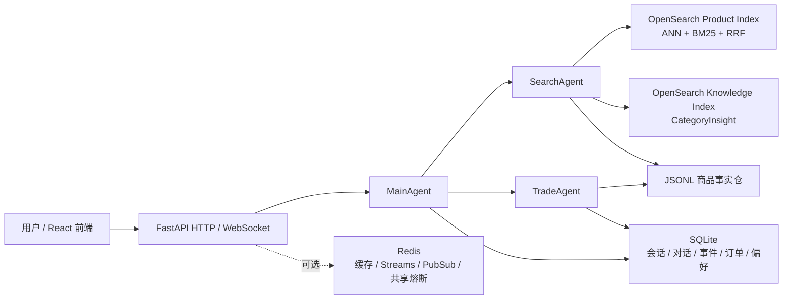

# CrossShop Agent

[](https://github.com/boluodaixue/CrossShop/actions/workflows/ci.yml)
[](LICENSE)
[](pyproject.toml)

CrossShop Agent 是一个基于 AgentScope 2.x 的跨境购物助手参考实现，探索如何把多 Agent 编排、混合商品检索、品类知识 RAG 和受控交易流程组合成一次连贯的购物对话。

用户只需用自然语言描述预算、用途、目的地或偏好，系统便可跨商品源寻找候选，解释关键差异，并在后续追问中延续同一段购物上下文。

这是一个可运行、可测试的工程样例，不是生产电商平台：不连接真实支付，也不承诺实时价格、库存、税费、配送或平台履约结果。

## 亮点

- 多平台商品搜索：按结构化属性、价格和平台条件组织结果。
- 混合检索：向量召回与关键词检索结合，支持跨平台搜索和可选 reranker。
- CategoryInsight：从独立知识库召回品类选购、属性和避坑信息，并保留来源元数据。
- 多轮上下文：保留当前购物旅程、上下文摘要和买家偏好，支持服务重启后的会话恢复。
- 受控交易流程：提供订单确认、查询和取消接口；订单状态不会由模型自由改写。
- 可观察的服务接口：FastAPI HTTP API、WebSocket 事件流和 React/Vite 前端。

## 工作方式



商品事实以只读规范化 JSONL 保存，由 `JsonlProductRepository` 读取。离线脚本将其写入 OpenSearch Product Index；在线查询把 ANN 向量召回和 BM25 关键词召回通过 RRF（Reciprocal Rank Fusion）合并，必要时再调用 reranker。CategoryInsight 使用独立的 OpenSearch Knowledge Index，知识文档在离线切块、向量化并发布后供运行时检索。

SQLite 默认保存于 `DATA_DIR/crossshop.db`，记录会话、对话消息、事件、订单、订单明细、买家偏好，以及每个 session 最新的一份 `AgentState` 快照。快照每轮覆盖更新，不提供历史状态回滚；Redis 用于可选的缓存、任务队列、跨进程事件和共享熔断，不保存会话状态。

## 快速开始

环境要求：Python 3.11–3.13、[uv](https://docs.astral.sh/uv/)。克隆项目后，可以先运行不依赖外部服务的离线测试，确认开发环境正常：

```powershell
uv sync
uv run ruff check .
uv run pytest
```

### 运行完整服务

完整应用依赖经过 manifest 校验的商品 JSONL 目录、商品 embedding endpoint、OpenSearch 商品/知识索引，以及一个 OpenAI-compatible LLM endpoint。复制配置模板并填写对应地址：

```powershell
Copy-Item .env.example .env
# 编辑 .env 中的 LLM、PRODUCT_CATALOG_ROOT、PRODUCT_EMBEDDING_* 和 OPENSEARCH_* 配置
uv run uvicorn app.presentation.server:app --reload --port 8000
```

商品和知识索引的构建参数可直接查看：

```powershell
uv run python scripts/index/build_product_opensearch.py --help
uv run python scripts/index/build_knowledge_opensearch.py --help
```

后端启动后，可在 `http://127.0.0.1:8000/health` 检查健康状态。前端需要 Node.js 18+：

```powershell
cd frontend
npm ci
npm run dev
```

也可以使用 Docker Compose 启动 app、worker、OpenSearch、Redis、Qdrant 和前端。请先准备 `data/processed/catalogs-v2` 商品目录，并在宿主机设置 Compose 要求的 LLM 与商品 embedding 配置：

```powershell
docker compose -f docker/docker-compose.yaml up -d --build
```

## 演示数据

`examples/data/products.jsonl` 是用于测试和演示的合成商品数据，不是真实 marketplace listing。`knowledge/public-demo-v1/` 提供可公开演示的 CategoryInsight 文档；文档中的来源说明是中文概括，不是官方原文，也不是实时合规承诺。知识数据的来源和发布边界见 [docs/RAG_DATA.md](docs/RAG_DATA.md)。完整的私有语料不随公共仓库分发，应放在仓库外并使用独立索引 alias。

## 配置

`.env.example` 列出了完整配置。常用变量如下：

| 用途 | 变量 |
| --- | --- |
| 模型 | `LLM_BASE_URL`、`LLM_API_KEY`、`LLM_MODEL` |
| 商品索引 | `PRODUCT_CATALOG_ROOT`、`PRODUCT_EMBEDDING_BASE_URL`、`PRODUCT_EMBEDDING_MODEL`、`PRODUCT_EMBEDDING_DIM`、`OPENSEARCH_ENDPOINT` |
| CategoryInsight | `CATEGORY_KB_BACKEND`、`CATEGORY_KNOWLEDGE_INDEX`、`CATEGORY_KB_COLLECTION` |
| 存储与队列 | `DATA_DIR`、`DATABASE_URL`、`REDIS_URL`、`QUEUE_ENABLED`、`BREAKER_SHARED` |
| 可选服务 | `RERANKER_BASE_URL`、`TAVILY_API_KEY`、LangFuse/OTLP 变量 |

环境变量优先于 `.env`。不要提交 `.env`、API key、私有语料、真实商品目录、数据库或生成索引。未配置 Redis 时，缓存和队列能力关闭，请求退化为 API 进程内执行；设置 `DATABASE_URL=file` 可使用本地 JSON 文件存储。

## 测试与 CI

默认测试使用 fake/in-memory 依赖，不要求在线模型、Redis、OpenSearch 或私有语料：

```powershell
uv run ruff check .
uv run pytest
```

OpenSearch、embedding、reranker、真实 LLM 和 Redis 检查是显式 opt-in 的集成或评测任务。GitHub Actions 的 offline job 运行公共离线测试，frontend job 执行 TypeScript/Vite 构建。

## 项目结构

```text
app/                 领域模型、Agent 编排、用例、基础设施和 FastAPI 接口
scripts/index/       商品与 CategoryInsight OpenSearch 索引脚本
scripts/eval/        召回、上下文和 rubric 评测脚本
examples/data/       合成公共商品示例
knowledge/           公开知识与 CategoryInsight 文档
eval/                评测案例、标注和数据契约
tests/               单元、契约和可选集成测试
frontend/            React + Vite 前端
docker/              Docker Compose 编排
docs/                数据说明与设计记录
```

## 限制与许可证

本项目用于工程学习、评测和演示，认证、真实支付、生产级库存/履约和多地域部署不在当前范围内。代码采用 Apache License 2.0，详见 [LICENSE](LICENSE) 与 [NOTICE](NOTICE)；第三方依赖、商品资料和模型的使用边界见 [THIRD_PARTY_DATA.md](THIRD_PARTY_DATA.md)。
